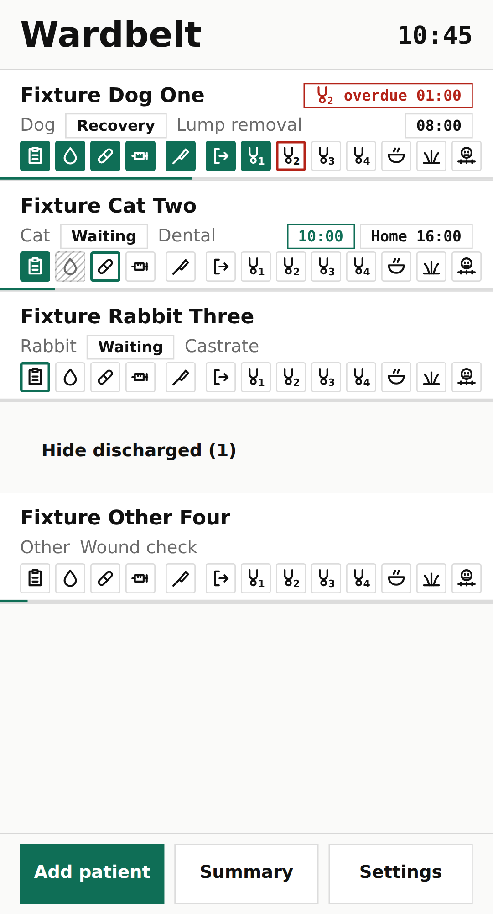
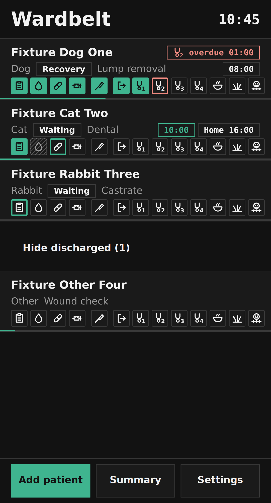
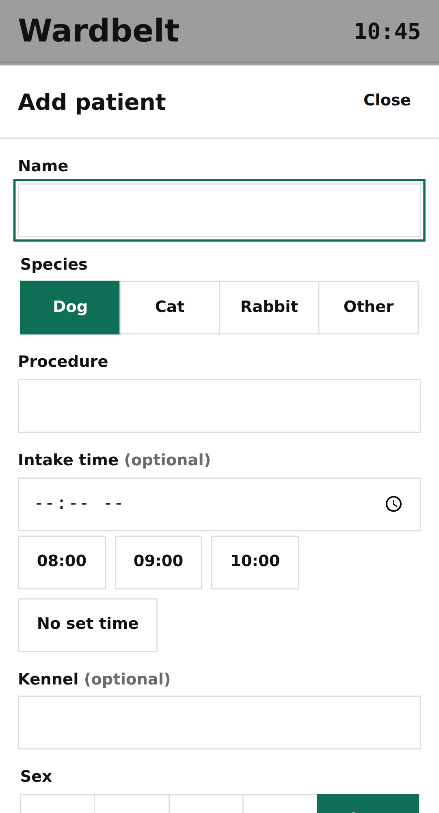
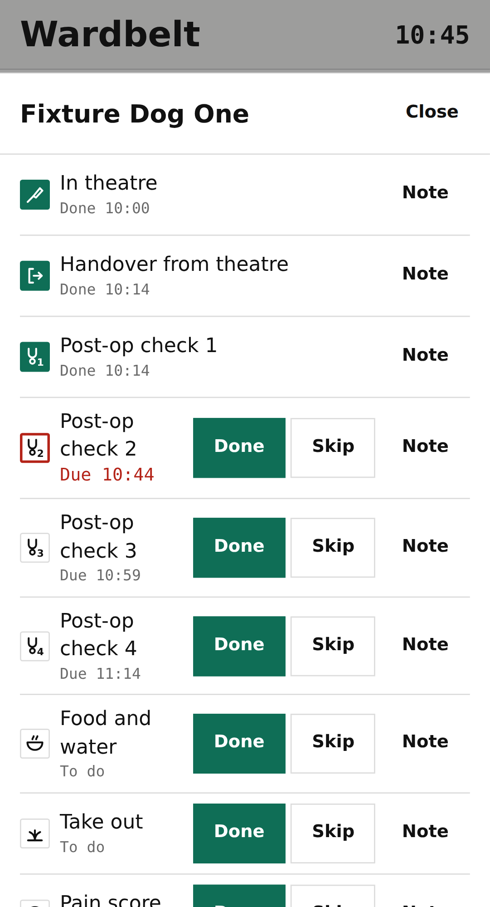
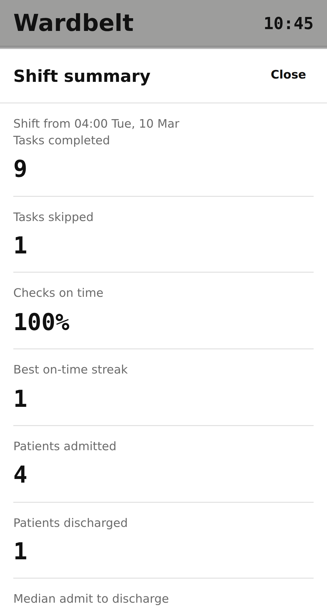
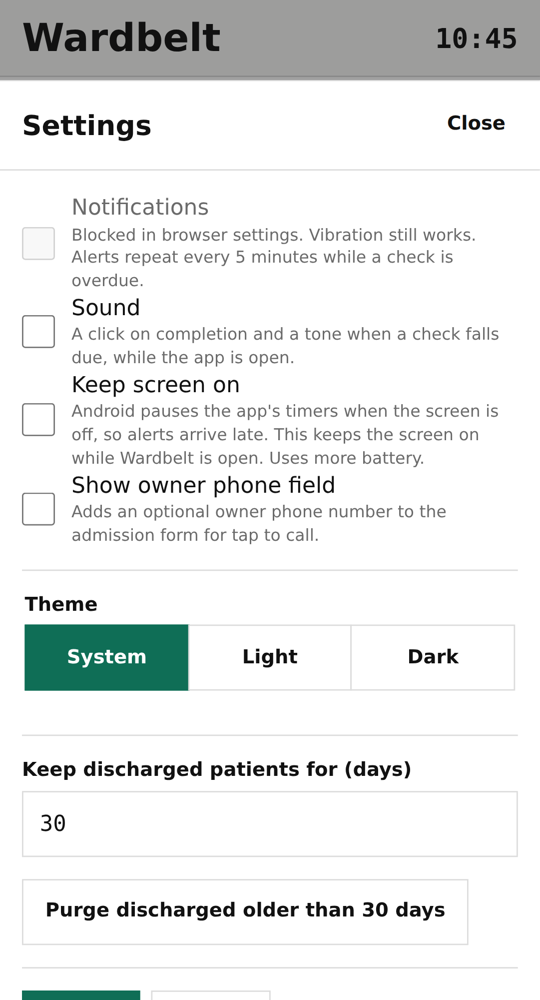

# Wardbelt

An installable Android web app for one Registered Veterinary Nurse running a surgical ward and
theatre shift. Each admitted animal gets a row on a board; the row is a belt of the surgical-day
task sequence, tapped through one step at a time. It runs entirely on the phone, offline, with
no account and no server.

The first half of this file is for the nurse. The second half, from
[For engineers](#for-engineers), is for people working on the code. Every number and every
behavioural claim below is traced to a document under `docs/` in the
[Claims and evidence](#claims-and-evidence) table at the end.

<p>
  
  
</p>

## For the nurse

### What it is

- One row per animal. The row's belt has 19 cells, one per step of the day: pre-op (handover
  and admit, bloods, draw up meds, premed, to theatre), theatre, recovery (handover from
  theatre, four post-op checks, food and water, take out, pain score), discharge prep (invoice,
  call owner, pharmacy collect, remove IV) and discharge.
- The outlined cell is the current step. Tap it to mark it done. Anything can be skipped or
  done out of order from the animal's sheet, because the ward does not run in order.
- When "In theatre" is marked done, the four post-op checks are set for 15, 30, 45 and 60
  minutes later. When one falls due the phone vibrates and the row moves to the top with a red
  chip counting how overdue it is.
- Everything stays on the phone. There is no login, no internet needed after the first open,
  and nothing is sent anywhere.
- It is a task list, not clinical advice: no dosing, no pain-score interpretation, no alerts
  about the animal's condition.

### Install on Android Chrome

The app is published by this repository's Pages workflow at
`https://smuddassirshah-cpu.github.io/wardbelt/`.

1. Open that address in Chrome on the phone. Wait for the board to show "No patients on the
   board. Add one to start." (that first load is the only one that needs the network).
2. Tap the three-dot menu in the top right of Chrome.
3. Tap "Add to Home screen" (on some versions of Chrome it reads "Install app").
4. Tap "Install" in the box that appears. Chrome puts a Wardbelt icon on the home screen.
5. Open it from the home screen from now on. It opens full screen without the browser bar,
   and it works with no signal or Wi-Fi.
6. Optional: in Settings inside the app, turn on Notifications and allow them when Chrome
   asks. Vibration works without this; the notification adds a message in the notification
   shade listing which checks are due. If Chrome has notifications blocked, the switch stays
   off and says so, and vibration still works.

### Add a patient and work the belt

<p>
  
  
</p>

1. Tap "Add patient" at the bottom of the board. Type the name and the procedure, tap the
   species and the intake slot (08:00, 09:00, 10:00 or none), and tap "Add patient". Kennel,
   sex, breed, weight and notes are optional. That is at most eight taps plus the typing.
2. The new row appears with the first cell outlined. Tap the outlined cell each time a step is
   done. A short buzz and a green fill confirm it; a 4-second message at the bottom offers Undo.
3. Tap the animal's name to open its sheet. There you can mark any step Done or Skip, add a
   Note to a step, Undo the last completion or skip, add a task of your own (with an optional
   due time) after any step, record the time back from theatre by hand, write notes for the
   animal, Discharge, or Delete.
4. Belt cells read: outline = to do; thicker green outline = current; green fill = done;
   grey hatching = skipped; red outline = a timed check that is overdue. The two letters are
   the step (HA handover and admit, BL bloods, DM draw up meds, PM premed, TH to theatre, IT
   in theatre, HT handover from theatre, C1 to C4 post-op checks, FW food and water, TO take
   out, PS pain score, IN invoice, CO call owner, PH pharmacy collect, IV remove IV, DC
   discharge). A task you added shows the first two letters of its label.
5. The board always keeps the animal that needs attention next at the top: overdue checks
   first, then checks due within five minutes, then animals with an intake slot, then the
   rest in the order they were added.
6. Discharging an animal (the DC cell, or the Discharge button on its sheet) takes it off the
   board. "Show discharged" at the bottom of the board lists them again.

### What the vibration means

- One short buzz: a step was marked done.
- Two short buzzes: that animal's belt is complete.
- Two long buzzes: a post-op check has just fallen due. The same buzz fires when the app
  wakes and finds checks that fell due while the screen was off, one buzz for all of them.
- If the phone has been asleep with the screen off for a long time, Android may hold the app
  back, and the buzz arrives late, when the screen comes on. While the screen has been on in
  the last few minutes the timing is reliable. Either way the board shows the overdue chip the
  moment you look at it.

### Summary, export and settings

<p>
  
  
</p>

- "Summary" shows the shift so far: a shift runs from 04:00 to 04:00. It counts tasks
  completed and skipped, the share of post-op checks done within three minutes of their time,
  the best run of on-time checks, animals admitted and discharged, and the typical time from
  admit to discharge.
- Export once a week. Settings, then "Export", gives you a single file named
  `wardbelt-export-<date>.json` through the phone's share sheet (send it to yourself, a drive,
  or a computer). If nothing has been exported for seven days and there is anything on the
  board, a reminder bar appears at the top with an Export button. "Import" reads such a file
  back and refuses the whole file if anything in it is malformed, so a bad file never damages
  what is already there.
- The phone is the only copy. A lost or reset phone loses the history unless it was exported.
- Discharged animals are kept for 30 days and then removed automatically; change the number
  of days in Settings, or use "Purge discharged" to remove them now. "Delete everything"
  wipes the app's data after a second tap to confirm.
- "Theme" switches to a dark theatre mode; "System" follows the phone.
- If the app is open in two Chrome tabs, the second one is read-only and says so at the top,
  so two tabs can never disagree about what has been done.
- When a new version is available the app shows "Update ready" with a Reload button. It never
  reloads by itself mid-shift.

### Lock the phone

The app holds client-identifiable data: animal names, procedures, times, any notes you type,
and the owner's phone number if you turn that field on. It sits in the phone's own storage,
unencrypted beyond what the phone itself provides. Keep the phone locked with a PIN or
fingerprint, do not lend it unlocked, and delete or export what you no longer need on it.

## For engineers

### Architecture

```
src/
  domain/      pure TypeScript, no I/O, no DOM, 100% covered
    template.ts   the 19-step template, phases, step keys, two-letter codes
    types.ts      Patient, Task, Event, Settings, State, Action union
    patient.ts    create from template, complete/skip/undo/add task, discharge
    recovery.ts   the four post-op checks at +15/30/45/60 min from theatre return
    urgency.ts    board sort: overdue > due soon > intake tag > created
    stats.ts      per-shift stats and streaks derived from events
    reducer.ts    single (state, action) -> state reducer
  store/       persistence boundary
    db.ts         idb schema, versioned migrations, injectable IDBFactory
    repo.ts       load all, save patient, append event, delete; retry once, then banner
    transfer.ts   JSON export and import with validation
  scheduler/   time boundary
    clock.ts      injectable clock (real and fake)
    timers.ts     next-due computation, one setTimeout capped at 60 s, resume on visibility
    notify.ts     permission, vibration, service-worker notification; no-op if denied
  ui/          Preact components, no business logic
    App.tsx, Board.tsx, PatientRow.tsx, Belt.tsx, PatientSheet.tsx, AddPatientSheet.tsx,
    ShiftSummary.tsx, Settings.tsx, feedback.ts, tokens.css (the only place colours,
    spacing and type are defined), DevGallery.tsx (#/dev renders every component state)
    app/          session wiring: store + reducer + persistence diff, scheduler, notifier,
                  tab lock, service-worker update bar, hash router, export chain
  sw.ts        service worker: Workbox precache of the app shell, notification click
  main.tsx     mount and boot
tests/
  unit/        Vitest: domain, store (fake-indexeddb), scheduler (fake clock), ui, app
  e2e/         Playwright on the Pixel 5 profile against the production build
  fixtures/    synthetic data only
scripts/       icon generation, evidence and gate scripts (bundle size, hardening, Lighthouse, coverage
               table, Pages base path, pre-push)
docs/          PLAN.md (the binding blueprint), DECISIONS.md, TESTING.md, evidence/, screenshots/
.github/       ci.yml (lint, typecheck, unit, build, bundle size, hardening, e2e), pages.yml
```

Data flow: a UI event raises an `Action`; the pure reducer returns a new `State`; signals
re-render the UI; the store persists the diff to IndexedDB; the scheduler's single timer
dispatches `TICK` and `DUE` actions back into the reducer and asks the notifier to vibrate.

### Stack and why

| Layer                 | Choice                                            | Why                                                                                                             |
| --------------------- | ------------------------------------------------- | --------------------------------------------------------------------------------------------------------------- |
| domain, store, timers | TypeScript, strict                                | Types catch state-machine errors at compile time; pure modules test in Node without a browser                   |
| ui                    | Preact 10 + @preact/signals                       | About 4 kB runtime; fine-grained re-render without a store library                                              |
| styling               | Plain CSS with custom properties                  | No preprocessor; `tokens.css` is the single source of the visual system                                         |
| persistence           | IndexedDB via `idb`                               | Structured records, indexes, headroom beyond 5 MB; one document per patient                                     |
| service worker        | vite-plugin-pwa (Workbox, injectManifest)         | Generated precache manifest is the reliable path to offline                                                     |
| tests                 | Vitest, @testing-library/preact, fake-indexeddb, Playwright, axe | fake-indexeddb tests the real store code path; Playwright on a Pixel 5 profile is the closest thing to the handset in CI |
| CI/CD                 | GitHub Actions, GitHub Pages                      | Free, static hosting, deploy only after a green CI run                                                          |

Runtime dependencies are exactly `preact`, `@preact/signals` and `idb`. Every version is
pinned and locked.

### Getting started

Node 22 and npm.

```
npm ci                 # install exactly the locked versions
npm run dev            # Vite dev server on http://localhost:5173/
npm test               # Vitest with coverage; 100% on src/domain is enforced
npm run test:e2e       # Playwright (Pixel 5) against a fresh production build on port 4173
npm run build          # production build into dist/
npm run lint           # eslint --max-warnings 0 and prettier --check
npm run typecheck      # tsc for the app and for the service worker
```

`npm run test:e2e` builds and serves the bundle itself. The first run needs
`npx playwright install chromium`. The dev gallery at `http://localhost:5173/#/dev` renders
every component in every state from fixtures; `?theme=dark` switches it.

Evidence scripts, each with `--no-build` (measure the existing `dist/`) and `--write`
(refresh `docs/evidence/*.json`, stamped with date and commit):

```
node scripts/bundle-size.mjs      # gzip total of dist/assets, exit 1 over 60 kB
node scripts/hardening.mjs        # CSP, no inline script, no console, precache, manifest
node scripts/lighthouse.mjs       # PWA, performance, accessibility, best practices
node scripts/coverage-table.mjs   # per-file src/domain table from the last npm test
node scripts/check-base-path.mjs  # builds with VITE_BASE_PATH=/wardbelt/ into a temp dir and checks it
```

### Pre-push gate

`scripts/pre-push.sh` runs, in order: a check that nothing is listening on the preview port
(so Playwright never tests a stale server), `npm run lint`, `npm run typecheck`, `npm test`,
`npm run build`, the bundle-size and hardening scripts on that build, the Pages base-path
check, `npm run test:e2e`, `gitleaks detect --source . --no-banner` over the full history, and a
clean-clone test (`git clone` of the working tree's HEAD into a temporary directory, then
`npm ci`, `npm run build`, `npm test`). It stops at the first failure and prints a summary
with the time each step took. `WARDBELT_TMP=<dir>` chooses where the clone is made.

Install it as a git pre-push hook without committing anything under `.git/hooks`:

```
ln -s ../../scripts/pre-push.sh .git/hooks/pre-push
```

or, if you keep hooks in a directory of your own:

```
mkdir -p ~/.githooks/wardbelt
ln -s "$PWD/scripts/pre-push.sh" ~/.githooks/wardbelt/pre-push
git config core.hooksPath ~/.githooks/wardbelt
```

Either way `git push` runs the whole gate first; `git push --no-verify` skips it. The script
finds the repository with `git rev-parse --show-toplevel` rather than from its own path, so it
works through either symlink (git runs hooks from the top of the working tree) and by hand from
any directory inside the checkout. `gitleaks` must be on the PATH (`brew install gitleaks` on
macOS).

### Evidence

All numbers come from recorded runs; `docs/TESTING.md` holds the tables and the exact commands,
and `docs/evidence/` holds the machine-readable summaries with their date and commit.

- Unit tests: 42 files, 483 tests. Coverage on `src/domain`: 100% of statements, branches,
  functions and lines (548/548, 406/406, 108/108, 532/532), enforced by `vitest.config.ts`.
  All files: 99.18% statements, 97.10% branches.
- End to end: 37 Playwright tests on the Pixel 5 profile against a fresh production build
  (flows, a scripted shift's stats, export/wipe/import, auto-purge, axe, install, screenshots),
  including an offline reload from the service worker and the second-tab lock.
- Lighthouse, mobile profile, production build: PWA 100, performance 100, accessibility 100,
  best practices 100 (targets were 95 for the first three).
- Bundle: 40.76 kB gzipped for every JS and CSS asset including the lazy chunks, against a
  60 kB limit; the shell's first paint loads 35.53 kB.
- axe (WCAG 2.0 A and AA, 2.1 AA) on the real board with data and on an open patient sheet, in
  light and dark: 0 violations. Every visible control is at least 48 by 48 px.
- `npm audit --audit-level=low`: 0 vulnerabilities across 568 packages.
- Hardening checks on `dist/`: 8 of 8 pass (CSP verbatim, no inline script, no console call
  in the app's assets, no eval, precache covers the shell, manifest installable).
- Install: `tests/e2e/install.spec.ts` fetches the served manifest and asserts name,
  standalone display, start_url and scope equal to the app base, the 192, 512 and maskable
  512 icons exist as PNGs, the theme colour, the manifest link and apple-touch-icon in the
  page, and that the service worker becomes ready and controls the page after a reload.
- Secrets: `gitleaks detect` over the full history finds no leaks.

### Deploy

`.github/workflows/ci.yml` runs on every push to `main` and `stage/**` and on pull requests:
lint, typecheck, unit tests with coverage, build, bundle size, hardening, Playwright e2e.
`.github/workflows/pages.yml` runs when that CI workflow completes successfully on `main` (or
by manual dispatch): it builds with `VITE_BASE_PATH=/wardbelt/` and `VITE_APP_VERSION` set to
the commit SHA, then deploys `dist/` with `actions/deploy-pages`. A red e2e run therefore never
deploys. `scripts/check-base-path.mjs` proves that the sub-path build has `start_url` and
`scope` of `/wardbelt/`, loads its assets from `/wardbelt/assets/` and registers
`/wardbelt/sw.js`.

The repository setting Pages must have its source set to "GitHub Actions" for the deploy job to
publish. Once it has, the app is at `https://smuddassirshah-cpu.github.io/wardbelt/`, and
`/wardbelt/manifest.webmanifest` and `/wardbelt/sw.js` are served from there.

### Data and privacy

- What is stored: for each patient, name, species, breed, sex, weight, procedure, kennel,
  intake slot, free-text notes, optional owner phone, the time admitted, back from theatre and
  discharged, and each task with its status, due time, done time and note. An append-only list
  of events (patient added, task added, completed, skipped, undone, theatre return, discharged)
  with timestamps. Settings (notifications, sound, theme, purge days, owner-phone field, last
  export time).
- Where: IndexedDB on the handset under the app's origin, database `wardbelt`, object stores
  `patients` (keyed by id, index on status), `events` (keyed by id, index on time) and
  `settings` (keyed by name). Encryption at rest is whatever the handset's storage encryption
  provides; the app adds none, because no key could be held that the same device could not
  read. If IndexedDB cannot be opened (private mode, quota, corruption) the app runs in memory
  for the session and shows "Not saving: storage unavailable" the whole time; a stored record
  that fails validation at boot is skipped and counted in a dismissible banner that offers an
  export of the raw rows for recovery.
- Retention and purge: discharged patients and their events are removed after 30 days by
  default (1 to 365 configurable), or on demand with "Purge discharged", or all at once with
  "Delete everything". Active patients are kept until discharged or deleted.
- Export and import: one JSON file `{schemaVersion, exportedAt, patients[], events[],
  settings}` through the Web Share API, falling back to a download and then to a copyable text
  box. Import is capped at 10 MB, requires the current schema version, validates every record
  field by field with the same rules as the forms, drops unknown fields, and rejects the whole
  file with a count of failing records rather than applying part of it.
- Input validation happens once, at the boundary: the patient form (name 1 to 40 characters,
  species and sex from fixed lists, weight 0.05 to 150 kg, procedure 1 to 80, notes up to 500,
  phone digits, plus and spaces only), the custom task form (label 1 to 60, due time within 24 h
  back or 48 h ahead) and the import file.
- No network: the app makes no request after the shell is cached; there are no analytics, no
  accounts, no secrets. The Content-Security-Policy meta tag in `index.html` is
  `default-src 'self'; style-src 'self' 'unsafe-inline'; img-src 'self' data:; manifest-src 'self'; worker-src 'self'`,
  and the build is checked for it.
- No logging: the production build contains no `console` call in the app's own code
  (`no-console` is a lint error); user-facing error text is built from the browser's error
  name and message only, never from a record. Test fixtures are synthetic.
- Two tabs: a `BroadcastChannel` lock makes a second tab read-only, so the only writer is one
  tab and the service worker never writes.

### Limitations

- Android may suspend the page when the screen is off for a long period; a due vibration can
  then arrive late, on wake. The Notification Triggers API that would fix this is not shipped
  in Chrome. Reliable while the screen has been on in the last few minutes, best effort
  otherwise; the board makes overdue state unmissable on wake.
- No cloud backup. A lost or reset phone loses history unless exported; export is one tap and
  the app nudges weekly.
- One fixed template. Procedure-specific presets were rejected for this version: the stated
  workflow is one list with skips, and presets add an admit-time decision at the worst moment
  of the day.
- The owner phone number on a personal device is a deliberate convenience with a stated
  privacy cost; the field is optional and off by default.
- Preact plus signals rather than vanilla DOM: about 4 kB and one dependency in exchange for
  far fewer state-sync bugs.
- No iOS testing. iOS Safari PWAs cannot vibrate and background notifications differ.
- Countdown chips and the header clock refresh on the scheduler's tick (at most 60 s apart), on
  every action and on visibility change, not every second.
- Multiple open tabs are not supported beyond the read-only lock; two tabs opened within the
  same 300 ms can both become the writer.

### Licence

MIT. See `LICENSE`.

## Claims and evidence

| Claim in this README                                                                 | Source                                                                                                     |
| ------------------------------------------------------------------------------------ | ---------------------------------------------------------------------------------------------------------- |
| Single-nurse, offline, no account, no server, no clinical decision support           | docs/PLAN.md section 1 (scope, non-goals)                                                                  |
| 19 belt cells and their two-letter codes, phases, "current" is the first to-do; custom task codes | docs/PLAN.md section 6 (task model); docs/DECISIONS.md 0.8, 0.16, 4.10                              |
| Post-op checks at +15/30/45/60 min from "In theatre" done                            | docs/PLAN.md section 6; docs/TESTING.md hardening checklist (flows e2e "theatre checks")                   |
| Board order: overdue, due within five minutes, intake tag, created                   | docs/PLAN.md section 3 (urgency.ts); docs/DECISIONS.md 1.3                                                  |
| Add a patient in at most eight taps                                                  | docs/PLAN.md section 11 stage 5 DoD; tests/e2e/flows.spec.ts                                               |
| Completion feedback: 30 ms buzz, green fill, 4 s toast with Undo                     | docs/PLAN.md section 10 (completion feedback); docs/DECISIONS.md 4.26                                       |
| Belt complete: two short buzzes (30 ms, 40 ms pause, 30 ms)                          | docs/PLAN.md section 10                                                                                     |
| Due check: two long buzzes (200, 100, 200 ms), one combined buzz on wake             | docs/PLAN.md section 8 (page backgrounded row); docs/DECISIONS.md 3.12                                      |
| Notifications optional; vibration works when blocked; no repeated prompting           | docs/PLAN.md section 8 (notification permission row); docs/DECISIONS.md 4.22, 5.5                           |
| Late vibration after long screen-off; reliable while screen recently on              | docs/PLAN.md section 9                                                                                      |
| Cell states: outline, current outline, green fill, hatch, red overdue outline        | docs/PLAN.md section 10 (belt); docs/DECISIONS.md 4.6                                                       |
| Shift 04:00 to 04:00; on time within 3 min; streak; seven stats                      | docs/PLAN.md section 6 (stats definitions)                                                                  |
| Export file name `wardbelt-export-<date>.json`; share, download, textarea chain      | docs/DECISIONS.md 6.9, 6.1, 6.2; docs/PLAN.md section 8 (export row)                                        |
| Weekly export reminder after 7 days with at least one patient                        | docs/PLAN.md section 9; docs/DECISIONS.md 6.4                                                               |
| Import rejected whole with a count of failing records; 10 MB cap; schema version     | docs/PLAN.md section 7 (import JSON)                                                                        |
| Discharged kept 30 days by default, 1 to 365 configurable; purge; Delete everything  | docs/PLAN.md sections 5 and 7; docs/DECISIONS.md 4.39, 6.7                                                  |
| Dark theatre mode; system theme                                                      | docs/PLAN.md section 10 (palette, dark)                                                                     |
| Second tab read-only with banner                                                     | docs/PLAN.md section 8 (concurrency); docs/DECISIONS.md 5.6                                                 |
| "Update ready" bar, never a silent reload                                            | docs/PLAN.md section 8 (service worker update row); docs/DECISIONS.md 5.7                                   |
| Data held and the instruction to lock the phone                                      | docs/PLAN.md section 7 (data held)                                                                          |
| Architecture tree and data flow                                                      | docs/PLAN.md sections 3 and 6; docs/DECISIONS.md 5.1 to 5.18 (src/ui/app wiring)                            |
| Stack and reasons; runtime dependencies preact, @preact/signals, idb; pinned         | docs/PLAN.md sections 4 and 10; docs/DECISIONS.md 0.1 to 0.7                                                |
| Dev gallery at #/dev renders every component state                                   | docs/PLAN.md section 11 stage 4 DoD; docs/DECISIONS.md 4.29 to 4.31                                         |
| 42 unit test files, 483 tests; domain 100% (548/548, 406/406, 108/108, 532/532); all files 99.18% / 97.10% | docs/TESTING.md Gate and Coverage; docs/evidence/coverage.json                                    |
| 37 Playwright tests including offline reload and the second-tab lock                 | docs/TESTING.md Stage 8 gate and Hardening checklist                                                        |
| Lighthouse 100/100/100/100 with targets of 95                                        | docs/TESTING.md Lighthouse; docs/evidence/lighthouse.json                                                   |
| Bundle 40.76 kB gzipped against 60 kB; first paint 35.53 kB                          | docs/TESTING.md Bundle size; docs/evidence/bundle-size.json                                                 |
| axe 0 violations, four scenes, both themes; 48 px targets                            | docs/TESTING.md axe; docs/evidence/axe.json                                                                 |
| npm audit 0 vulnerabilities, 568 packages                                            | docs/TESTING.md Audit                                                                                       |
| Hardening 8 of 8 checks; CSP string                                                  | docs/TESTING.md Hardening checklist; docs/evidence/hardening.json                                           |
| Install check contents                                                               | docs/TESTING.md Stage 8 gate; tests/e2e/install.spec.ts                                                     |
| gitleaks over full history clean                                                     | docs/TESTING.md Stage 8 gate                                                                                |
| Pre-push gate steps and hook install                                                 | scripts/pre-push.sh; docs/TESTING.md Stage 8 gate; docs/DECISIONS.md 8.6, 8.7, 8.9, 8.12                    |
| CI steps; Pages deploys only after CI success on main; VITE_BASE_PATH and version    | docs/PLAN.md section 8 (config); docs/DECISIONS.md 0.12, 8.5, 8.11; .github/workflows/ci.yml, pages.yml     |
| Sub-path build has start_url and scope /wardbelt/ and loads /wardbelt/assets/        | docs/TESTING.md Stage 8 gate (check-base-path); scripts/check-base-path.mjs                                 |
| Storage schema (database and three stores), memory fallback with banner              | docs/PLAN.md sections 5 and 8; docs/DECISIONS.md 2.2, 5.4, 5.8                                              |
| Validation rules at the boundary                                                     | docs/PLAN.md section 7 (entry points and validation)                                                        |
| No network, no logging, synthetic fixtures, CSP verified in the build                | docs/PLAN.md section 7; docs/TESTING.md Hardening checklist                                                 |
| Limitations                                                                          | docs/PLAN.md section 9; docs/DECISIONS.md 5.2, 5.7                                                          |
| Licence MIT                                                                          | LICENSE; docs/PLAN.md section 10                                                                            |
| Screenshots: seeded synthetic scene, Pixel 5, fixed clock 10:00 Tue 10 Mar 2026      | docs/DECISIONS.md 8.2, 8.3; tests/e2e/screenshots.spec.ts                                                   |
